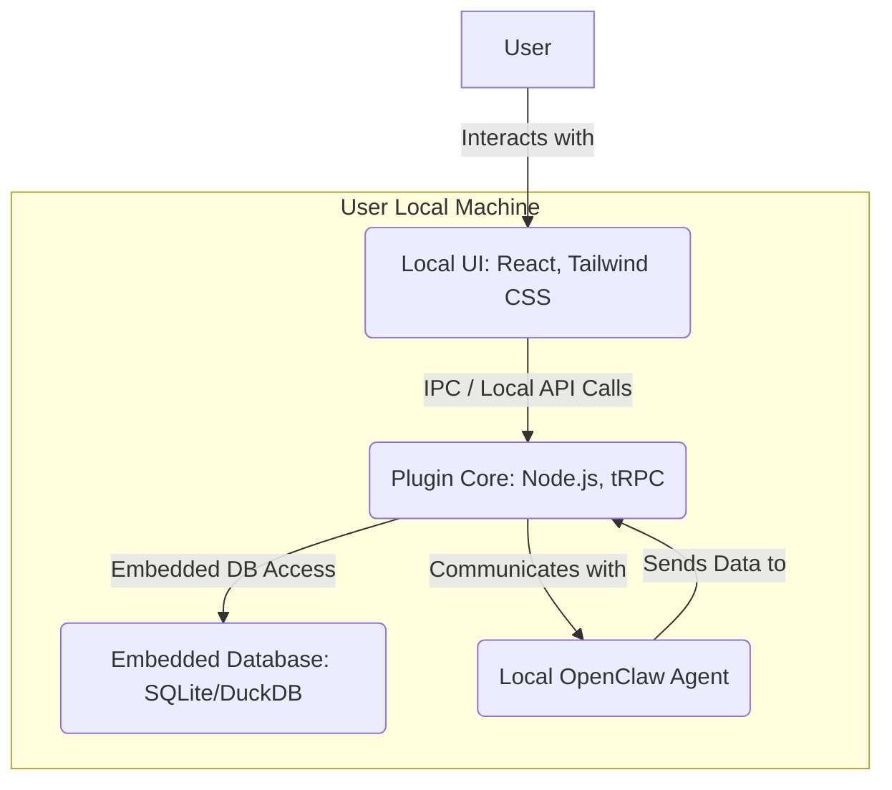

# OpenClaw Mission Control Dashboard: High-Level Architecture Overview

## 1. Introduction

This document provides a high-level overview of the OpenClaw Mission Control Dashboard's architecture, presenting both its current state as a self-hosted full-stack web application and a proposed alternative as a locally deployed open-source plugin. Understanding these architectural models is crucial for strategic planning and future development.

## 2. Current Architecture: Self-Hosted Full-Stack Web Application

The current architecture of the OpenClaw Mission Control Dashboard is a robust, self-hosted full-stack web application designed for comprehensive AI agent management. It comprises distinct layers that work together to provide a rich user experience and powerful backend capabilities [1].

### 2.1 Architectural Diagram (Current)

```mermaid
graph TD
    User[User] -->|Accesses via Browser| Frontend(Web Browser: React, Tailwind CSS)
    Frontend -->|API Calls (tRPC)| Backend(Backend Server: Express, Node.js)
    Backend -->|Database Queries (Drizzle ORM)| Database(Database: MySQL/TiDB)
    Backend -->|Authenticates| Auth(Manus OAuth)
    Backend -->|Communicates with| OpenClawAgent(OpenClaw Agent)
    OpenClawAgent -->|Sends Data to| Backend
    subgraph User Infrastructure
        Frontend
        Backend
        Database
        Auth
        OpenClawAgent
    end
```

### 2.2 Components and Interactions (Current)

*   **User**: Interacts with the dashboard through a web browser.
*   **Frontend (Web Browser)**: A React 19 application styled with Tailwind CSS 4, running in the user's browser. It provides the graphical user interface for monitoring, managing, and interacting with OpenClaw agents.
*   **Backend Server**: An Express 4 server running on Node.js, exposing tRPC procedures. It handles business logic, data processing, and acts as an intermediary between the frontend, database, and OpenClaw agents.
*   **Database**: A MySQL or TiDB database managed by Drizzle ORM, used for persistent storage of agent data, task information, user configurations, and other application-specific data.
*   **Manus OAuth**: Provides secure authentication and authorization for users accessing the dashboard.
*   **OpenClaw Agent**: The core AI agent that the dashboard monitors and manages. The backend communicates with the agent to retrieve real-time metrics, send commands, and track its activities.
*   **User Infrastructure**: All components (Frontend, Backend, Database, Auth, OpenClaw Agent) are typically deployed and managed by the user on their own server infrastructure (e.g., VPS, cloud instance).

## 3. Proposed Architecture: Locally Deployed Open-Source Plugin

The proposed architecture shifts towards a locally deployed, open-source plugin model, aiming to provide a more developer-centric, privacy-focused, and easily distributable solution. This model emphasizes local execution and tighter integration with the OpenClaw agent's local environment [2].

### 3.1 Architectural Diagram (Proposed)



### 3.2 Components and Interactions (Proposed)

*   **User**: Interacts with the local UI of the plugin directly on their machine.
*   **Local UI**: A React 19 application, potentially embedded within an Electron shell or integrated as a webview within a desktop application, providing the user interface. It would still use Tailwind CSS for styling.
*   **Plugin Core**: The core logic of the plugin, likely running as a Node.js process. It would expose local tRPC procedures or other Inter-Process Communication (IPC) mechanisms for the UI to interact with. This core handles data processing, local agent communication, and embedded database operations.
*   **Embedded Database**: A lightweight, embedded database such as SQLite or DuckDB, used for local persistence of data. This eliminates the need for a separate database server.
*   **Local OpenClaw Agent**: The OpenClaw agent running directly on the user's local machine. The Plugin Core communicates with this agent to monitor its activities and manage tasks.
*   **User Local Machine**: All components of the plugin (Local UI, Plugin Core, Embedded Database, Local OpenClaw Agent) are installed and run directly on the user's desktop or local server, offering maximum privacy and control.

## 4. Conclusion

The architectural shift from a self-hosted full-stack web application to a locally deployed open-source plugin represents a significant change in deployment and interaction models. While the current architecture offers robust, centralized management, the proposed plugin model prioritizes local control, privacy, and ease of installation for individual users and developers within the OpenClaw ecosystem.

## References

[1]: /home/ubuntu/our_deployment_method.md "Our OpenClaw Mission Control Dashboard: Deployment Method"
[2]: /home/ubuntu/architecture_change_complexity.md "Architecture Change Complexity: Full-Stack Web Application to Locally Deployed Open-Source Plugin"
